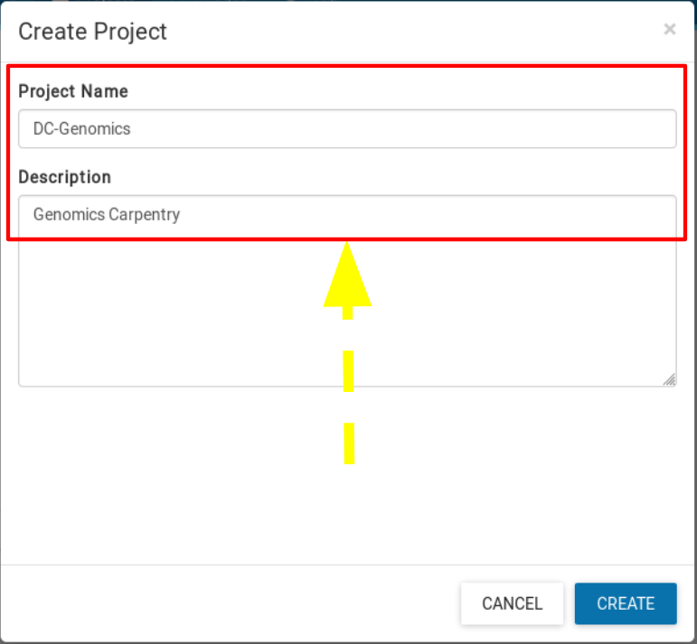
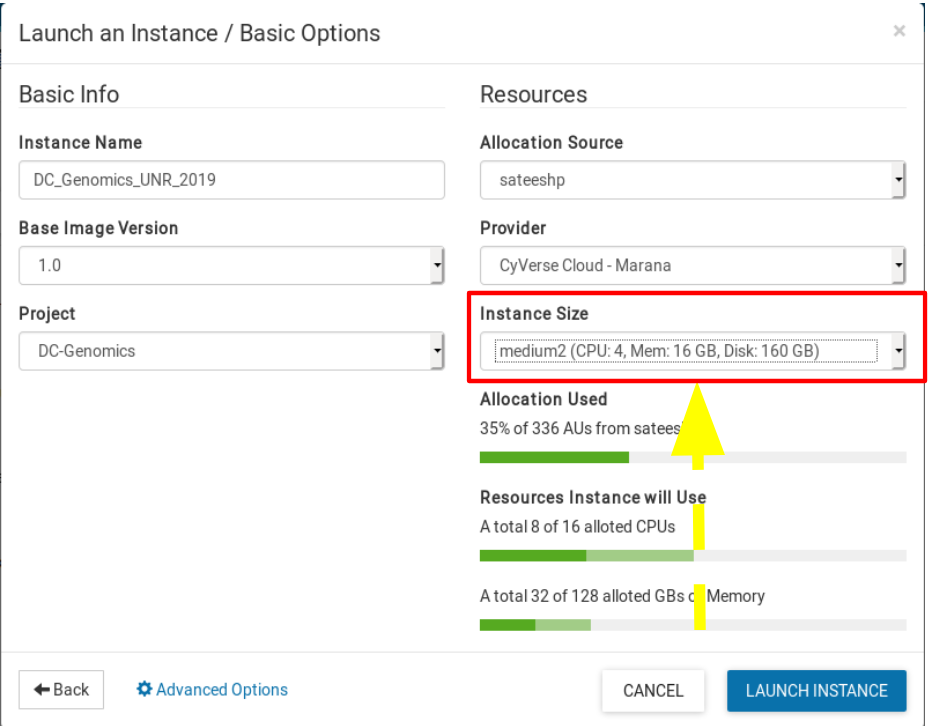
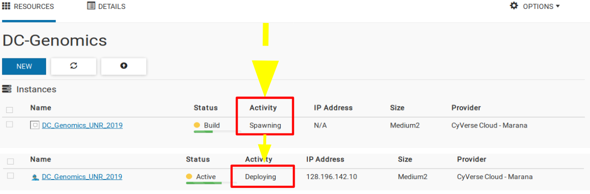
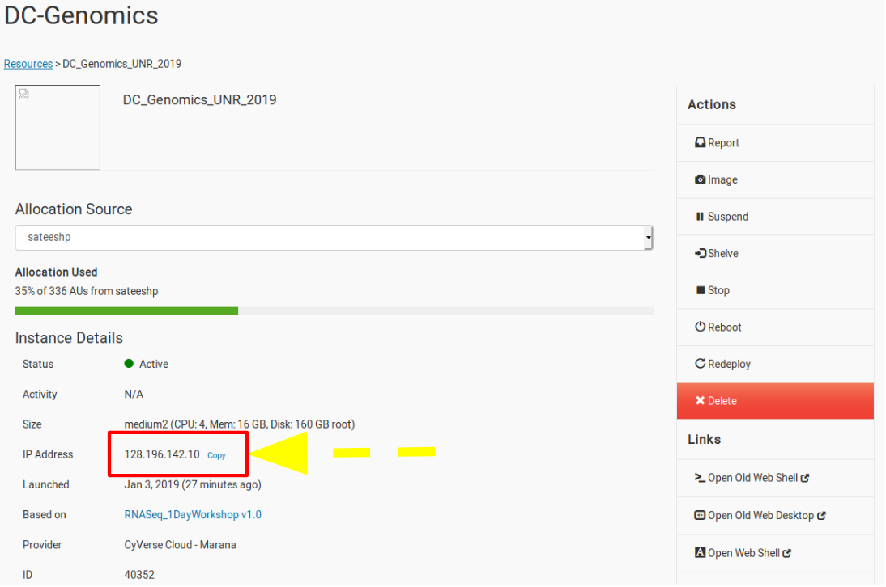
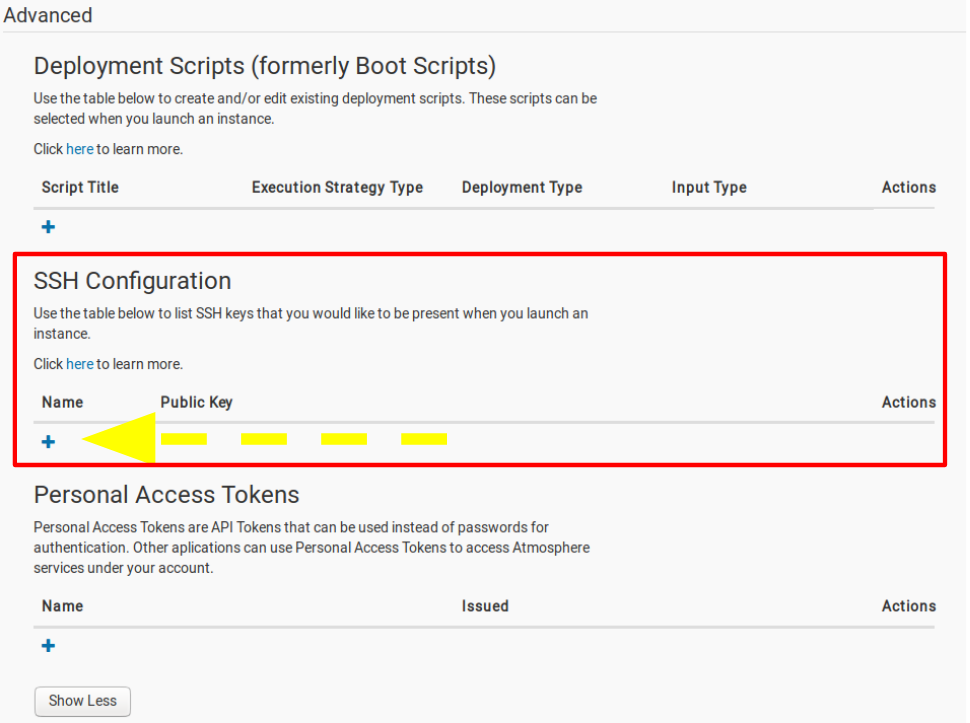
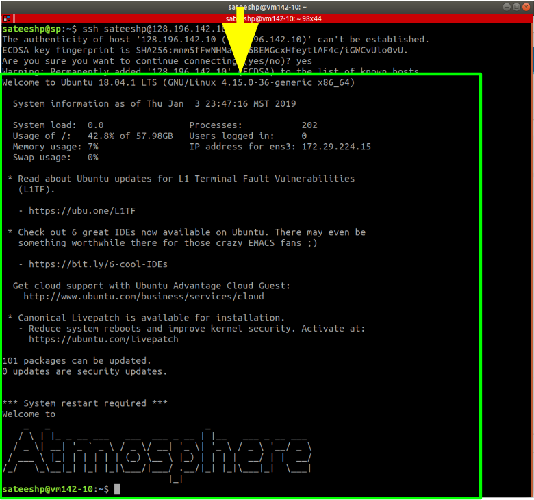
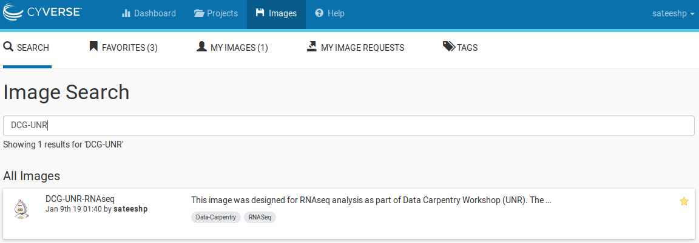

**Logging onto Atmosphere Cloud**
=================================

For the duration of this workshop, we will be accessing data and tools
required to analyze our data on a remote computer using the **CyVerse's Atmosphere cloud**.

This is the first and last place in these lessons where it will matter if you are using PC, Mac, or Linux. After we connect, we will all be on
the same operating system/computing environment.

Below, we've provided screenshots of the whole process. You can click on them to zoom in. The important areas to fill in are highlighted.

First, go to the `Atmosphere <https://atmo.cyverse.org/application/images>`_ application and then click `login`

|atmo-1|

.. important::

  As descrbied in the `pre-workshop setup <https://sateeshperi.github.io/2019-01-15-reno/>`_, you need to have access to the CyVerse Atmosphere Cloud. If you are not able to log-in for some reason, please let us know and we will fix it immediately.

1. Fill in the username and password and click "LOGIN"

- Fill in the username, which is your CyVerse username, and then enter the password (which is your CyVerse password).

|atmo-2|

2. Select the "Projects" tab and then click the "CREATE NEW PROJECT" button

- This is something you only need to do once.

- A project is a workspace that lets you keep things together.

3. Click on the "Projects" tab on the top and then click the "CREATE NEW PROJECT" button

|atmo-3|

|atmo-4|

4. Enter the name "DC-Genomics" into the Project Name and put something simple like "Genomics Carpentry" into the description. Then click "CREATE".

|atmo-5|

5. Select the newly created project

- Click on your newly created project.

- Click "NEW" and then "Instance" from the dropdown menu to start up a new virtual machine.

|atmo-6|

6. Naviagate to "Show All" tab and Search for "DC_Genomics_UNR_2019"; click the "DC_Genomics_UNR_2019" image.

|atmo-img|

7. Name your virtual machine something simple such as "workshop" or leave it as default which is the image name and select the following"

	-	Provider: "CyVerse Cloud - Marana"

	- 	Instance size: "medium2 (CPU: 4, Mem: 16GB, Disk: 160GB)"

	- 	Leave rest of the fields as default.

|atmo-7|

- Wait for it to become active

- It will now be booting up! This will take 2-5 minutes. Just wait! Don't reload or do anything.One the virtual machine is ready, the "Status" column will turn green and described as "Active" (see below)

|atmo-8|

8. **Setting up Secure Login - SSH**

8.1. **Concerning Keys**

	Cryptographic keys are a convenient and secure way to authenticate without having to use passwords. They consist of a pair of files called the public and private keys: the public part can be shared with whoever you’d like to authenticate with (in our case, CyVerse Atmosphere!), and the private part is kept “secret” on your machine. Things that are encrypted with the public key can be be decrypted with the private key, but it is computationally intractable (ie, it would take on the order of thousands of years) to determine a private key from a public key. You can read more about it [here](https://www.digitalocean.com/community/tutorials/how-to-set-up-ssh-keys--2)

8.2. **Create the RSA Key Pair**

- The first step is to create the key pair on your laptop/computer:

```
$ ssh-keygen -t rsa
```

8.3. **Store the Keys and Passphrase**

- Once you have entered the Gen Key command, you will get a few more questions:

```
$ Enter file in which to save the key (/home/demo/.ssh/id_rsa):
```

- You can press enter here, saving the file to the user home (in this case, my example user is called demo).

```
$ Enter passphrase (empty for no passphrase):
```

- It's up to you whether you want to use a passphrase though we recommend NOT to!.

- The public key is now located in /home/demo/.ssh/id_rsa.pub. The private key (identification) is now located in /home/demo/.ssh/id_rsa

8.4. **Copy the Public Key**

- Once the key pair is generated, it's time to place the public key on the server that we want to use.

```
$ cat ~/.ssh/id_rsa.pub
```

- Copy all of the text that constitutes your public key and we will place it our Atmosphere accounts.

8.5. **Deposit key on Atmosphere**

You are now ready to deposit your generated public key onto your Atmosphere account, to gain secure login each time you build and use an instance on Atmosphere.

9. Click on your username on the Atmosphere page and navigate to 'Settings' page

|atmo-10|

10. Scroll down to the advanced section and click on 'Show More'

|atmo-11|

11. In the 'SSH Configuration' section, click on the '+' sign 

|atmo-12|

12. Paste your public key generated earlier and give this key a name

|atmo-13|

- You can now securely login to all the instances you launch on Atmosphere without having to type a password each-time you login.  

13. Navigate back to 'Projects' and click on your new instance's name to get more information!

14. Copy the IP address of your instance

|atmo-9|

15. **Log in from your computer's terminal**

- Now that you have set up your public key with CyVerse, you can open you terminal (if you are using Windows OS, please follow our log in guidelines by MobaXterm to open a Unix Based terminal or if you have already installed Ubuntu terminal through Developer mode, feel free to use that).

- Open the Terminal window and type the following:

```
ssh your_CyVerseusername@ip_address
```
|atmo-14|

- This should log you into CyVerse and you should see a screen like this:

|atmo-15|

- Enter 'Yes' and the keys are matched and secure login with crytographic keys has been established and should see the following on your terminal.

|atmo-16|

16. **Deleting your instance**

- To completely remove your instance, you can select the "Delete" button from the instance details page.

|atmo-17|

- This will open up a dialogue window. Select the "Yes, delete this instance" button.

|atmo-18|

- It may take Atmosphere a few minutes to process your request. The instance should disappear from the project when it has been successfully deleted.

.. Note::

  It is advisable to delete the machine if you are not planning to use it in future to save valuable resources. However if you want to use it in future, you can suspend it.
  
17. **On Windows**

For Windows, we first need to actually *install* a terminal.

18. Install mobaxterm

First, download [mobaxterm home edition (portable)](http://mobaxterm.mobatek.net/download-home-edition.html)
and run it.

19. Start a new session


20. Fill in session settings

Fill in your "remote host," which will be the IP address from earlier. Then select
"specify username" and enter your class group name (e.g. dibbears).


21. Specify the session key

Copy the downloaded private file onto your primary hard disk (generally
C:) and the put in the full path to it.


22. Click OK

Victory!


  
.. |atmo-1| image:: ./img/atmo_1.png
.. |atmo-2| image:: ./img/atmo_2.png
.. |atmo-3| image:: ./img/atmo_3.png
.. |atmo-4| image:: ./img/atmo_4.png

.. |atmo-6| image:: ./img/atmo_6.png



.. |atmo-10| image:: ./img/atmo_10.png
.. |atmo-11| image:: ./img/atmo_11.png

.. |atmo-13| image:: ./img/atmo_13.png
.. |atmo-14| image:: ./img/atmo_14.png
.. |atmo-15| image:: ./img/atmo_15.png

.. |atmo-17| image:: ./img/atmo_17.png
.. |atmo-18| image:: ./img/atmo_18.png

